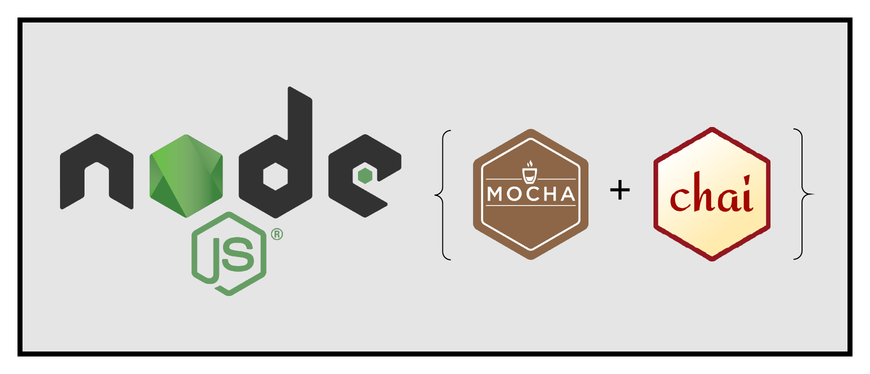
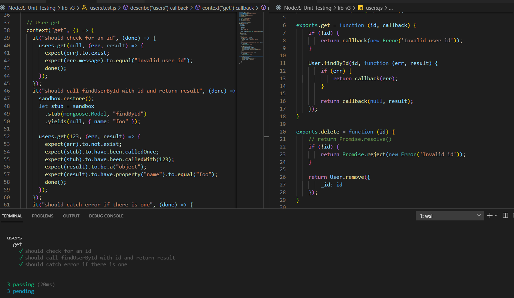
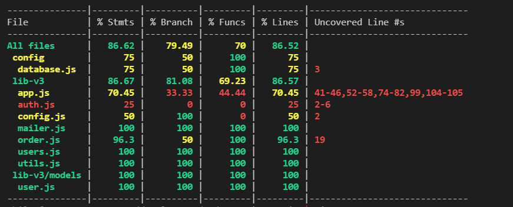

# Behavior-driven development (BDD) - Node.js - Unit Testing using Mocha ☕️, Chai and SinonJS.

_May 2021_

> 🔨 Node Unit testing. From udemy '[Node.js Unit Testing In-Depth (Murtez Alrohani)](https://www.udemy.com/course/nodejs-unit-testing-in-depth)'.

<h1 align="center">
    
</h1>

<h1 align="center">
    
</h1>

<h1 align="center">
    
</h1>

<h1 align="center">
    
</h1>

## Overview

### Behavior-driven development (BDD)

Mocha.js provides a variety of interfaces for defining test suites, hooks, and individual tests, including TSS, Exports, QUnit, and Require. The default interface is BDD.

Behavior-driven development (BDD) aims to help developers build software that is predictable, resilient to changes, and not error-prone. It evolved from test-driven development (TDD), which requires you to:

- Write tests for the required software functionality
- Run the tests for the software functionality
- Implement the software functionality
- Fix bugs and refactor until all tests pass
- Repeat the cycle for any new functionality

The main difference between TDD and BDD is that BDD calls for writing test cases in a shared language to simplify communication between technical and nontechnical stakeholders, such as developers, QA teams, and business leaders.

Another difference is that in TDD, test are written first and the test has to fail. Then The code is written to make the test pass.

### Test doubles

We use double testing to isolate the code we are testing or wanting to analyze. These are objects that mimic real objects.


- Test stub — used for providing the tested code with "indirect input". Stubbing, like mocking, means creating a stand-in, but a stub only mocks the behavior, but not the entire object. This is used when your implementation only interacts with a certain behavior of the object.
- Mock object — used for verifying "indirect output" of the tested code, by first defining the expectations before the tested code is executed. Mocking means creating a fake version of an external or internal service that can stand in for the real one, helping your tests run more quickly and more reliably. When your implementation interacts with an object’s properties, rather than its function or behavior, a mock can be used.
- Test spy — used for verifying "indirect output" of the tested code, by asserting the expectations afterwards, without having defined the expectations before the tested code is executed. It helps in recording information about the indirect object created.
- Fake object — used as a simpler implementation, e.g. using an in-memory database in the tests instead of doing real database access.
- Dummy object — used when a parameter is needed for the tested method but without actually needing to use the parameter.

### Mocha: exemple of use

`sudo npm i -g mocha`

`mocha my-file.js`

**Exemples in ./lib**

```js
const assert = require("assert");

describe("file to be tested", () => {
  context("function to be tested", () => {
    it("should do something", () => {
      assert.strictEqual(1, 2);
    });
  });
});
```

When a function has not been created yet but we need something to remind.

```js
const assert = require("assert");

describe("file to be tested", () => {
  context("function to be tested", () => {
    it("should do something", () => {
      assert.strictEqual(1, 2);
    });

    it("should do something else", () => {
      assert.deepStrictEqual({ name: "joe" }, { name: "joe" });
    });

    it("this is a pending test");
  });
});
```

Output:

```bash
  file to be tested
    function to be tested
      1) should do something
      ✓ should do something else
      - this is a pending test


  1 passing (8ms)
  1 pending
  1 failing
```

### Chai

Chai has several interfaces that allow the developer to choose the most comfortable (ex: Should, Expect or Assert). The chain-capable BDD styles provide an expressive language & readable style, while the TDD assert style provides a more classical feel.

```js
const chai = require("chai");
const expect = chai.expect;

describe("file to be tested", () => {
  it("should compare some values", () => {
    expect(1).to.equal(1);
  });
  it("should test some stuffs", () => {
    expect({ name: "foo" }).to.deep.equal({ name: "foo" });
    expect({ name: "foo" }).to.have.property("name").to.equal("foo");
    expect(5 > 8).to.be.false;
    expect({}).to.be.a("object");
    expect("foo").to.be.a("string");
    expect(3).to.be.a("number");
    expect("bar").to.be.a("string").with.lengthOf(3);
    expect(null).to.be.null;
    expect(undefined).to.not.exists;
    expect(1).to.exist;
  });
});
```

### Structure of files for tests

#### Option 1 (most used, ex Angular)

```
-lib
---v1
-----nested
-------nested.js
-------nested.test.js
---foo.js
---foo.test.js
---bar.js
---bar.test.js
```

To test:

`mocha ./lib --recursive` => will test all js files

`mocha ./lib/**/*.test.js` => will test all test.js files

#### Option 2

```
lib
--v1
----nested
------nested.js
--foo.js
--bar.js

test
--lib
----v1
------nested
--------nested.js
----foo.js
----bar.js
```

To test:

`mocha ./tests --recursive`

### Package.json

```json
{
  "scripts": {
    "test": "mocha './lib/**/*.test.js'"
  },
  "devDependencies": {
    "chai": "^4.3.4"
  }
}
```

`npm test`

Using cross-env

```json
{
  "scripts": {
    "test": "cross-env NODE_ENV=development mocha './lib/**/*.test.js'"
  },
  "devDependencies": {
    "chai": "^4.3.4",
    "cross-env": "^7.0.3"
  }
}
```

`npm test`

### Use with a file to test

**Exemples in ./lib-v2**

_demo.js_

```js
exports.add = function (a, b) {
  return a + b;
};
```

_demo.test.js_

```js
const chai = require("chai");
const expect = chai.expect;

var demo = require("./demo");

describe("demo", () => {
  context("add", () => {
    it("should add two numbers", () => {
      expect(demo.add(1, 2)).to.equal(3);
    });
  });
});
```

`npm test` => ✓ should add two numbers

### Use with a callback simulating delay

_demo.js_

```js
exports.addCallback = function (a, b, callback) {
  setTimeout(() => {
    return callback(null, a + b);
  }, 500);
};
```

_demo.test.js_

```js
const chai = require("chai");
const expect = chai.expect;

var demo = require("./demo");

describe("demo", () => {
  context("callback add", () => {
    it("should test the callback", (done) => {
      demo.addCallback(1, 2, (err, result) => {
        expect(err).to.not.exist;
        expect(result).to.equal(3);
        done();
      });
    });
  });
});
```

### Use with a promise

**Exemples in ./lib-v2**

_demo.js_

```js
exports.addPromise = function (a, b) {
  // return Promise.reject(new Error('fake'))
  return Promise.resolve(a + b);
};
```

_demo.test.js_

```js
const chai = require("chai");
const expect = chai.expect;
const chaiAsPromised = require("chai-as-promised");
chai.use(chaiAsPromised);

var demo = require("./demo");

describe("demo", () => {
  context("test promise", () => {
    it("should add with a promise cb", (done) => {
      demo
        .addPromise(1, 2)
        .then((result) => {
          expect(result).to.equal(3);
          done();
        })
        .catch((ex) => {
          console.log("caught error");
          done(ex);
        });
    });
    it("should test a promise with return", () => {
      return demo.addPromise(1, 2).then((result) => {
        expect(result).to.equal(3);
      });
    });
    it("should test promise with async await", async () => {
      let result = await demo.addPromise(1, 2);
      expect(result).to.equal(3);
    });
    it("should test promise with chai as promised", async () => {
      await expect(demo.addPromise(1, 2)).to.eventually.equal(3);
    });
  });
});
```

### Spies

**Exemples in ./lib-v2**

Spy is recording all of the activities of a function and we can validate the returned value of it, we can verify the arguments, throws exceptions and so on.

_demo.js_

```js
//spy on log
exports.foo = () => {
  //some operation
  console.log("console.log was called");
  console.warn("console.warn was called");

  return;
};
```

_demo.test.js_

```js
const chai = require("chai");
const expect = chai.expect;
const sinon = require("sinon");
const sinonChai = require("sinon-chai");
chai.use(sinonChai);

var demo = require("./demo");

describe("demo", () => {
  context("test doubles", () => {
    it("should spy on log", () => {
      let spy = sinon.spy(console, "log");
      demo.foo();

      expect(spy.calledOnce).to.be.true; // sinon
      expect(spy).to.have.been.calledOnce; // sinon chai
      spy.restore(); // reset
    });
  });
});
```

### Stubs

**Exemples in ./lib-v2**

A test stub is a function or object that replaces the actual behavior of a module with a fixed response. The stub can only return the fixed response it was programmed to return.

A stub can be seen as an assumption for our test - if we assume that an external service returns this response, this is how the function will behave.

_demo.js_

```js
//stub createfile
exports.bar = async (fileName) => {
  await exports.createFile(fileName);
  let result = await callDB(fileName);

  return result;
};

exports.createFile = (fileName) => {
  console.log("---in createFile");
  //fake create file
  return new Promise((resolve) => {
    setTimeout(() => {
      console.log("fake file created");
      return Promise.resolve("done");
    }, 100);
  });
};

function callDB(fileName) {
  console.log("---in callDB");
  //fake create file
  return new Promise((resolve) => {
    setTimeout(() => {
      console.log("fake db call");
      resolve("saved");
    }, 100);
  });
}
```

_demo.test.js_

```js
const chai = require("chai");
const expect = chai.expect;
const sinon = require("sinon");
const sinonChai = require("sinon-chai");
chai.use(sinonChai);

var demo = require("./demo");

describe("demo", () => {
  context("test doubles", () => {
    it("should stub console.warn", () => {
      let stub = sinon.stub(console, "warn").callsFake(() => {
        console.log("message from stub");
      });

      demo.foo();
      expect(stub).to.have.been.calledOnce;
      expect(stub).to.have.been.calledWith("console.warn was called");
      stub.restore();
    });
  });
  context("stub private functions", () => {
    it("should stub createFile", async () => {
      let createStub = sinon.stub(demo, "createFile").resolves("create_stub");
      let callStub = sinon.stub().resolves("calldb_stub");

      demo.__set__("callDB", callStub);

      let result = await demo.bar("test.txt");

      expect(result).to.equal("calldb_stub");
      expect(createStub).to.have.been.calledOnce;
      expect(createStub).to.have.been.calledWith("test.txt");
      expect(callStub).to.have.been.calledOnce;
    });
  });
});
```

Note:

Please remember to use _var_ instead of _const_ when using rewire to import a module, it's easy to miss when you use const everything at the top of your code.

This is because rewire will inject the rewired versions, and we reset that during teardown. It's ok to use const on requiring rewire itself, but use var for everything else.

```js
const rewire = require("rewire");

var myModule = rewire("../path/to/custom/module");
```

## Testing an app

**Exemples in ./lib-v3**

CRUD: _user.test.js_:

- Users.get()
- Users.delete()
- Users.create()
- Users.update()
- Users.resetPassword()

```batch
  users
    get
      ✓ should check for an id
      ✓ should call findUserById with id and return result
      ✓ should catch error if there is one
    delete user
      ✓ should check for an id using return
      ✓ should check for error using eventually
      ✓ should call User.remove
    create user
      ✓ should reject invalid args
      ✓ should call User with new
      ✓ should save the user
      ✓ should call mailer with email and name
      ✓ should reject errors
    update user
      ✓ should find user by id
      ✓ should call user.save
      ✓ should reject if there is an error
    reset password
      ✓ should check for email
      ✓ should call sendPasswordResetEmail
```

MAILER: _mailer.test.js_:

- sendWelcomeEmail()
- sendPasswordResetEmail()
- sendEmail()

```batch
  mailer
    sendWelcomeEmail
      ✓ should check for email and name
      ✓ should call sendEmail with email and message
    sendPasswordResetEmail
      ✓ should check for email
      ✓ should call sendEmail with email and message
    sendEmail
      ✓ should check for email and body
      ✓ should call sendEmail with email and message (101ms)
```

UTILS: _utils.test.js_:

- getHash()

```batch
  utils
    ✓ should return null if invalid string is passed
    ✓ should get secret from config
    ✓ should call crypto with correct settings and return hash
```

Routes: _app.test.js_:

- get: _/_
- post: _/user/:id_
- delete: _/user/:id_
- handleError()

```batch
  app
    GET /
      ✓ should get /
    POST /user
      ✓ should call user.create
      ✓ should call handleError on error
    DELETE /user/:id
      ✓ should call auth check function and users.delete on success
      ✓ should call handleError on error
    handleError
      ✓ should check error instance and format message
      ✓ should return object without changing it if not instance of error
```

MODELS: _./models/user.test.js_:

- mongoose required fields
- mongoose optionnal field

```batch
  User model
    ✓ should return error fields required ares are missing
    ✓ should have optional age field
```

CLASSES: _order.test.js_:

- class Order instance
- Method save
- Method cancel
- Prototype ship

```batch
  order
    ✓ should create instance or Order and calculate total + shipping
    ✓ should update status to active and return order details
    ✓ should cancel an order, update status and set shipping and total to zero
    ✓ should update status to shipped
```

## Dependancies

- [mocha](https://www.npmjs.com/package/mocha): Simple, flexible, fun JavaScript test framework for Node.js & The Browser ☕️.

`mocha i -g mocha`

- [express](https://www.npmjs.com/package/express): Fast, unopinionated, minimalist web framework for node.

`npm i express`

- [mongoose](https://www.npmjs.com/package/mongoose): Mongoose is a MongoDB object modeling tool designed to work in an asynchronous environment. Mongoose supports both promises and callbacks.

`npm i mongoose`

## Dev dependancies

- [chai](https://www.npmjs.com/package/chai): Chai is a BDD / TDD assertion library for node and the browser that can be delightfully paired with any javascript testing framework.

`npm i -D chai`

- [cross-env](https://www.npmjs.com/package/cross-env): cross-env makes it so you can have a single command without worrying about setting or using the environment variable properly for the platform.

`npm i -D cross-env`

- [Chai Assertions for Promises](https://www.chaijs.com/plugins/chai-as-promised/): Chai as Promised extends Chai with a fluent language for asserting facts about promises.

`npm i -D chai-as-promised`

- [sinon](https://www.npmjs.com/package/sinon): Standalone and test framework agnostic JavaScript test spies, stubs and mocks.

`npm i -D sinon`

- [Sinon.JS Assertions for Chai](https://www.chaijs.com/plugins/sinon-chai/): Sinon–Chai provides a set of custom assertions for using the Sinon.JS spy, stub, and mocking framework with the Chai assertion library. You get all the benefits of Chai with all the powerful tools of Sinon.JS.

`npm i -D sinon-chai`

- [rewire](https://www.npmjs.com/package/rewire): rewire adds a special setter and getter to modules so you can modify their behaviour for better unit testing.

`npm i -D rewire`

- [supertest](https://www.npmjs.com/package/supertest): The motivation with this module is to provide a high-level abstraction for testing HTTP, while still allowing you to drop down to the lower-level API provided by superagent.

`npm I -D supertest`

- [istanbuljs/nyc](https://github.com/istanbuljs/nyc): Istanbul instruments your ES5 and ES2015+ JavaScript code with line counters, so that you can track how well your unit-tests exercise your codebase..

`npm i -D nyc`

```json
  "scripts": {
    "coverage": "cross-env NODE_ENV=development nyc --reporter=text npm test"
  },
```

`npm run coverage`

NB: each file to test need its ".test." version otherwise it will not be listed in the report.

## Useful links

- [Node assert](https://nodejs.org/api/assert.html)
- [Mocha](https://mochajs.org/)
- [Mocha.js, the JavaScript test framework: A tutorial](https://blog.logrocket.com/a-quick-and-complete-guide-to-mocha-testing-d0e0ea09f09d/)
- [Chai](https://www.chaijs.com/)
- [Chai Plugins](https://www.chaijs.com/plugins/)
- [Sinon.js](https://sinonjs.org/)
- [Unit Testing with Mocha, Chai, and Sinon — SPY](https://krishnenduh31.medium.com/unit-testing-with-nodejs-spy-45ec0831a037)
